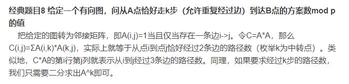

### 1. Playing with Beads

 There are N people in a group labeled from 1 to N. People are connected to each other via threads in the following manner:

The person with label K is connected to all the people with label J such that J exactly divides K. Beads can be passed through the threads. if a person P has a bead, in how many ways can the bead be passed in the network of threads so that it return to the same person within X moves on less.

*MOVE*: Passing the bead from one person to the other.

**Input Specification:**

```
input1: N, denoting the number of people
input2: P, label of the people having bead
input3: X, Maximum number of moves that can be made
```

**output Specification:**

```
Your function should return the total number of ways in which the bead will retrun to the initial position within X moves.
```

**Example 1:**

```
input1: 3
input2: 2
input3: 2
```

```
output: 1
```

**Explanation:**

```
Only one way:
2->1->2
```

**Example 2:**

```
input1: 3
input2: 2
input3: 4
```

```
output: 3
```

**Explanation:**

```
Ways:
2->1->2
2->1->2->1->2
2->1->3->1->2
```

#### 解题思路：

这题的题目有点绕。其实这题就是一个图的可达路径问题。



按照上面的算法，我们很容就写出代码了：

