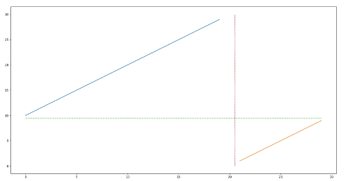

### 153. Find Minimum in Rotated Sorted Array

Suppose an array sorted in ascending order is rotated at some pivot unknown to you beforehand.

(i.e.,  `[0,1,2,4,5,6,7]` might become  `[4,5,6,7,0,1,2]`).

Find the minimum element.

You may assume no duplicate exists in the array.

**Example 1:**

```
Input: [3,4,5,1,2] 
Output: 1
```

**Example 2:**

```
Input: [4,5,6,7,0,1,2]
Output: 0
```

#### **解题思路：**

这题如果按照$O(n)$的复杂度做的话，是十分简单的。只要遍历一次数组就可以了。但是我们可以找到更加优秀的算法。由于数组是”有序”的，只是经过了一个旋转。如果我们画出数组里面的元素的图的话，大概如下：



其中蓝的和橙色的线段表示数据，另外的横和竖的虚线是标线。这就是我们拿到的数组的数据的情况。我们要找的最小的元素就是橙色线段的最左边的那个点。很显然我们还是可以利用二分查找的。如果$nums[r] < nums[mid]$, 那么说明$l,  mid$ 位于蓝色线段上，因此$l=mid+1$ ，否则$mid $ 位于橙色线段上，$r = mid$ ,(这里要注意的是r=mid，而不是r=mid-1，因为有可能会越过边界). 代码如下：

```c++
class Solution {
public:
    int findMin(vector<int>& nums) 
    {
        int l = 0;
        int r = nums.size() -1;
        if(nums[l] < nums[r])
            return nums[l];
        while(l<r)
        {
            int mid = (l+r)/2;
            if(nums[mid] > nums[r])
                l = mid + 1;
            else
                r = mid;
        }
        return nums[l];
    }
};
```

### 154. Find Minimum in Rotated Sorted Array II

Suppose an array sorted in ascending order is rotated at some pivot unknown to you beforehand.

(i.e.,  `[0,1,2,4,5,6,7]` might become  `[4,5,6,7,0,1,2]`).

Find the minimum element.

The array may contain duplicates.

**Example 1:**

```
Input: [1,3,5]
Output: 1
```

**Example 2:**

```
Input: [2,2,2,0,1]
Output: 0
```

**Note:**

- This is a follow up problem to [Find Minimum in Rotated Sorted Array](https://leetcode.com/problems/find-minimum-in-rotated-sorted-array/description/).
- Would allow duplicates affect the run-time complexity? How and why?

#### **解题思路：**

这题是基于上一题的，但是不同的是，这里允许有重复的元素。这个变化会带来更加麻烦的二分查找的边界处理。

```c++
class Solution {
public:
    int findMin(vector<int>& nums) 
    {
        int l = 0;
        int r = nums.size() -1;
        if(nums[l] < nums[r])
            return nums[l];
        while(l<r)
        {
            int mid = (l+r)/2;
            if(nums[mid] > nums[r])
                l = mid + 1;
            else if(nums[mid] < nums[r])
                r = mid;
            else
                r = r-1;
        }
        return nums[l];
    }
};
```